<!-- AUTO-GENERATED -->

<div align="right">

[English](README-en.md) · [中文](README.md)

</div>

<h1 align="center">deepseek-enhancer</h1>

<p align="center">
  <strong>Tools, Skills, and Agent Loop for DeepSeek Web</strong>
  <br />
  <em>Chrome MV3 Extension · XHR Interception · Tool Calling · Skill Injection</em>
</p>

<p align="center">
  <a href="#quick-start"></a>
  <a href="#license"></a>
</p>

<p align="center">
  
  
  
  
</p>

## Features

- 🔧 **Tool Calling** — Auto-injects `web_search`, `web_fetch`, `news_hub`, `github_trending`, `doc_generate` into model context
- 🧩 **Skill System** — 8 built-in skills (deep thinking, code review, writing, translation, etc.) with custom creation and GitHub import
- 🔄 **Agent Loop** — SSE stream parsing → tool call detection → background execution → DOM submit, driving multi-step reasoning
- 🎨 **UI Enhancements** — Widescreen mode, multi-theme switching, font customization, scrollbar hiding, auto-hide input
- 📤 **Chat Export** — One-click Markdown / HTML export, tool results wrapped as code blocks
- ⌨️ **Quick Input** — `/` triggers skill selection dropdown, React 18 re-render compatible

## Quick Start

### Install Dependencies

```bash
pnpm install
```

### Development Mode (HMR)

```bash
pnpm dev
```

Open Chrome, go to `chrome://extensions`, enable "Developer mode", click "Load unpacked", select the `dist/chrome-mv3/` directory.

### Build Production

```bash
pnpm build
```

Output in `dist/chrome-mv3/`.

### Configure Tavily API Key

> `web_search` and `web_fetch` require a Tavily API Key. `news_hub` and `github_trending` work without one.

1. Click the extension icon to open the management panel
2. Enter your Tavily Key in the API Key field
3. Click "Test Connection" to verify

## Usage

### Enable Agent Mode

Open the right-side management panel, toggle "Agent Mode" on. Tool definitions are auto-injected into the prefix of every sent message.

### Use Skills

Type `/` in the input box to trigger the skill dropdown. Once selected, skill instructions are injected into the system context:

```
/ultra-think explain the fundamentals of quantum computing
```

### Custom Skills

Panel → "Skills" tab → "New Skill":
- `name`: kebab-case unique identifier
- `description`: one-line description
- `instructions`: system instruction content

Supports import from GitHub URL or local Markdown files.

### Export Chat

Panel bottom button → choose Markdown or HTML format. Auto-scrolls to top before export to ensure all virtual-scrolled messages are loaded.

## Architecture

```mermaid
%%{init: {'theme': 'base', 'themeVariables': {'fontSize': '14px'}}}%%
flowchart LR
    User[User Input] --> Isolated[Isolated Layer<br/>content.ts]
    Isolated --> |postMessage| MAIN[MAIN Layer<br/>main-xhr-inject.ts]
    MAIN --> |augment prompt| XHR[XHR Interception<br/>prompt injection]
    XHR --> DeepSeek[DeepSeek API<br/>SSE stream]
    DeepSeek --> |SSE response| Parser[SSE Parser<br/>tool call detection]
    Parser --> |tool call found| Exec[tool-executor.ts]
    Exec --> |chrome.runtime| Background[Background<br/>Service Worker]
    Background --> |Tavily API| Tavily[Tavily Search<br/> Tavily Extract]
    Background --> |news/github| Scrape[Web Scraping<br/>no API Key]
    Tavily --> |results| DOM[domSubmitText<br/>fill + submit]
    Scrape --> |results| DOM
    DOM --> |new XHR| XHR

    classDef client fill:#3B82F6,stroke:#2563EB,color:#fff,stroke-width:2px
    classDef service fill:#10B981,stroke:#059669,color:#fff,stroke-width:2px
    classDef external fill:#F43F5E,stroke:#E11D48,color:#fff,stroke-width:2px
    classDef data fill:#8B5CF6,stroke:#7C3AED,color:#fff,stroke-width:2px

    class User,Isolated client
    class MAIN,XHR,Parser,Exec,DOM service
    class Background data
    class Tavily,Scrape,DeepSeek external
```



### Three-Tier Runtime

| Layer | File | Environment | Responsibility |
|-------|------|-------------|----------------|
| **MAIN** | `src/entrypoints/main-world.content.ts` + `src/core/main-xhr-inject.ts` | Page context `<script>` injection | XHR interception, prompt augmentation, SSE parsing |
| **Isolated** | `src/entrypoints/content.ts` | Isolated content script | UI management, tool execution, event coordination |
| **Background** | `src/entrypoints/background.ts` | Service Worker | Tavily API proxy, CORS bypass |

MAIN ↔ Isolated communicate via `window.postMessage`, messages tagged with `source: 'DS_MINI_ISOLATED'` / `'DS_MINI_MAIN'`.

### Agent Tool Calling Loop

1. MAIN layer intercepts `XMLHttpRequest.prototype.send` → injects tool definitions into prompt
2. SSE progress events → parse text → regex detects `<web_search>{...}</web_search>`
3. → postMessage → Isolated → `chrome.runtime.sendMessage` → Background → Tavily API
4. → results submitted via `domSubmitText()` (fill textarea + click send button)
5. → page initiates new XHR → loop continues or model replies naturally

## Project Structure

```
deepseek-enhancer/
├── src/
│   ├── entrypoints/          # Chrome extension entry points
│   │   ├── main-world.content.ts   # MAIN layer (page injection)
│   │   ├── content.ts              # Isolated layer (content script)
│   │   └── background.ts           # Background (service worker)
│   ├── core/                 # Core logic
│   │   ├── main-xhr-inject.ts      # XHR interception + prompt augmentation + SSE parsing
│   │   ├── context-builder.ts      # Tool definition XML builder + skill injection
│   │   ├── sse-parser.ts           # SSE stream parsing + tool call extraction
│   │   ├── tool-executor.ts        # Tool call dispatch
│   │   ├── tool-descriptors.ts     # 5 tool definitions
│   │   ├── skill-registry.ts       # Skill CRUD (chrome.storage.local)
│   │   ├── skill-builtin.ts        # 8 built-in skills
│   │   ├── skill-importer.ts       # GitHub / local import
│   │   ├── ui-panel.ts             # Floating management panel
│   │   ├── ui-autocomplete.ts      # / triggered skill dropdown
│   │   ├── ui-tool-blocks.ts       # Tool call result UI + DOM submit
│   │   ├── ui-categories.ts        # Panel category tabs
│   │   ├── chat-exporter.ts        # Markdown/HTML export
│   │   ├── enhancer-features.ts    # Widescreen/theme/font/scrollbar
│   │   ├── fetch-hook.ts           # Fetch interception (backup path)
│   │   ├── conversation-store.ts   # Conversation state management
│   │   └── types.ts                # Shared type definitions
│   └── env.d.ts
├── public/                   # Static assets
├── docs/                     # Documentation
│   ├── adr/                  # Architecture Decision Records
│   └── specs/                # Feature specifications
├── wxt.config.ts             # WXT extension config
├── vitest.config.ts          # Test config
└── package.json
```

## Tools

| Tool | Description | API Key Required |
|------|-------------|:---:|
| `web_search` | Tavily search engine for real-time info | ✅ |
| `web_fetch` | Tavily webpage full-text extraction | ✅ |
| `news_hub` | Aggregate 8 platforms (Baidu/Weibo/GitHub/Zhihu/36kr/arXiv/HN/Reddit) | ❌ |
| `github_trending` | GitHub Trending project list | ❌ |
| `doc_generate` | Trigger browser download of model Markdown output | ❌ |

## Built-in Skills

| Skill | Description |
|-------|-------------|
| `ultra-think` | Deep thinking, multi-angle analysis + hypothesis testing |
| `code-review` | Code review: correctness / security / performance / readability |
| `writer` | Polish, translate, summarize, rewrite |
| `article-writer` | Structured long-form writing with outline and references |
| `translator` | Multi-language translation, terminology consistency + cultural adaptation |
| `researcher` | Deep research with cross-source validation |
| `code-assistant` | Code generation, explanation, debugging, refactoring |
| `summarizer` | Multi-style summaries (one-liner / bullet points / detailed) |

## Tech Stack

| Technology | Purpose |
|------------|---------|
| TypeScript | Primary language |
| WXT | Chrome MV3 extension framework |
| Chrome Storage API | Skill / config persistence |
| Tavily API | Search + webpage extraction |
| js-sha3 | SHA-3 hashing (WASM) |
| Vitest | Unit testing |
| ESLint + Prettier | Code standards |

## Scripts

| Command | Description |
|---------|-------------|
| `pnpm dev` | Development mode (HMR) |
| `pnpm dev:firefox` | Firefox development mode |
| `pnpm build` | Build production bundle |
| `pnpm zip` | Pack to zip |
| `pnpm test` | Run tests |
| `pnpm typecheck` | Type checking |
| `pnpm lint` | ESLint check |
| `pnpm format` | Prettier formatting |

## Contributing

1. Fork the repository
2. Create a feature branch (`git checkout -b feature/amazing`)
3. Commit your changes (`git commit -m 'feat: add amazing feature'`)
4. Push to the branch (`git push origin feature/amazing`)
5. Open a Pull Request

Ensure `pnpm typecheck`, `pnpm lint`, and `pnpm format:check` all pass before committing.

## License

[MIT](.agents/skills/LICENSE)
