<!-- AUTO-GENERATED -->

<div align="right">

[English](README-en.md) · [中文](README.md)

</div>

<h1 align="center">deepseek-enhancer</h1>

<p align="center">
  <strong>给 DeepSeek 网页端加上 Tools、Skills 和 Agent 循环</strong>
  <br />
  <em>Chrome MV3 扩展 · XHR 拦截 · 工具调用 · 技能注入</em>
</p>

<p align="center">
  <a href="#快速开始"></a>
  <a href="#许可证"></a>
</p>

<p align="center">
  
  
  
  
</p>

## 功能特性

- 🔧 **工具调用** — 自动注入 `web_search`、`web_fetch`、`news_hub`、`github_trending`、`doc_generate` 到模型上下文
- 🧩 **技能系统** — 内置 8 个技能（深度思考、代码审查、写作、翻译等），支持自定义创建和 GitHub 导入
- 🔄 **Agent 循环** — SSE 流解析 → 工具调用检测 → 后台执行 → DOM 提交，驱动模型多步推理
- 🎨 **UI 增强** — 宽屏模式、多主题切换、字体自定义、滚动条隐藏、自动隐藏输入框
- 📤 **会话导出** — 一键导出 Markdown / HTML，工具结果自动包装为代码块
- ⌨️ **快捷输入** — `/` 触发技能选择下拉，React 18 重渲染兼容

## 快速开始

### 安装依赖

```bash
pnpm install
```

### 开发模式（热更新）

```bash
pnpm dev
```

打开 Chrome，访问 `chrome://extensions`，开启「开发者模式」，点击「加载已解压的扩展程序」，选择 `dist/chrome-mv3/` 目录。

### 构建生产包

```bash
pnpm build
```

产物在 `dist/chrome-mv3/`。

### 配置 Tavily API Key

> `web_search` 和 `web_fetch` 需要 Tavily API Key。`news_hub` 和 `github_trending` 无需 Key。

1. 点击扩展图标打开管理面板
2. 在 API Key 输入框填入你的 Tavily Key
3. 点击「测试连接」确认生效

## 使用方法

### 启用 Agent 模式

打开右侧管理面板，开启「Agent 模式」开关。工具定义会自动注入到每条发送的消息前缀中。

### 使用技能

在输入框输入 `/` 触发技能下拉，选择后技能指令会注入到系统上下文中：

```
/ultra-think 解释量子计算的底层原理
```

### 自定义技能

面板 → 「Skills」标签 → 「新建技能」：
- `name`：kebab-case 唯一标识
- `description`：一行描述
- `instructions`：系统指令内容

支持从 GitHub URL 导入或从本地 Markdown 文件导入。

### 导出会话

面板底部按钮 → 选择 Markdown 或 HTML 格式。导出前会自动滚动到顶部确保虚拟滚动中的消息全部加载。

## 架构

```mermaid
%%{init: {'theme': 'base', 'themeVariables': {'fontSize': '14px'}}}%%
flowchart LR
    User[用户输入] --> Isolated[Isolated Layer<br/>content.ts]
    Isolated --> |postMessage| MAIN[MAIN Layer<br/>main-xhr-inject.ts]
    MAIN --> |增强 prompt| XHR[XHR 拦截<br/>prompt 注入]
    XHR --> DeepSeek[DeepSeek API<br/>SSE 流]
    DeepSeek --> |SSE 响应| Parser[SSE Parser<br/>工具调用检测]
    Parser --> |检测到工具调用| Exec[tool-executor.ts]
    Exec --> |chrome.runtime| Background[Background<br/>Service Worker]
    Background --> |Tavily API| Tavily[Tavily Search<br/> Tavily Extract]
    Background --> |news/github| Scrape[网页抓取<br/>无需 API Key]
    Tavily --> |结果| DOM[domSubmitText<br/>填充+提交]
    Scrape --> |结果| DOM
    DOM --> |新 XHR| XHR

    classDef client fill:#3B82F6,stroke:#2563EB,color:#fff,stroke-width:2px
    classDef service fill:#10B981,stroke:#059669,color:#fff,stroke-width:2px
    classDef external fill:#F43F5E,stroke:#E11D48,color:#fff,stroke-width:2px
    classDef data fill:#8B5CF6,stroke:#7C3AED,color:#fff,stroke-width:2px

    class User,Isolated client
    class MAIN,XHR,Parser,Exec,DOM service
    class Background data
    class Tavily,Scrape,DeepSeek external
```



### 三层运行时

| 层级 | 文件 | 运行环境 | 职责 |
|------|------|---------|------|
| **MAIN** | `src/entrypoints/main-world.content.ts` + `src/core/main-xhr-inject.ts` | 页面上下文 `<script>` 注入 | XHR 拦截、prompt 增强、SSE 解析 |
| **Isolated** | `src/entrypoints/content.ts` | 隔离 content script | UI 管理、工具执行、事件协调 |
| **Background** | `src/entrypoints/background.ts` | Service Worker | Tavily API 代理、跨域绕过 |

MAIN ↔ Isolated 通过 `window.postMessage` 通信，消息标记 `source: 'DS_MINI_ISOLATED'` / `'DS_MINI_MAIN'`。

### Agent 工具调用循环

1. MAIN 层拦截 `XMLHttpRequest.prototype.send` → 将工具定义注入 prompt
2. SSE progress 事件 → 解析文本 → 正则检出 `<web_search>{...}</web_search>`
3. → postMessage → Isolated → `chrome.runtime.sendMessage` → Background → Tavily API
4. → 结果通过 `domSubmitText()` 提交（填充 textarea + 点击发送按钮）
5. → 页面发起新 XHR → 循环继续或模型自然回复

## 项目结构

```
deepseek-enhancer/
├── src/
│   ├── entrypoints/          # Chrome 扩展入口
│   │   ├── main-world.content.ts   # MAIN 层（页面注入）
│   │   ├── content.ts              # Isolated 层（content script）
│   │   └── background.ts           # Background（service worker）
│   ├── core/                 # 核心逻辑
│   │   ├── main-xhr-inject.ts      # XHR 拦截 + prompt 增强 + SSE 解析
│   │   ├── context-builder.ts      # 工具定义 XML 构建 + skill 注入
│   │   ├── sse-parser.ts           # SSE 流解析 + 工具调用提取
│   │   ├── tool-executor.ts        # 工具调用分发
│   │   ├── tool-descriptors.ts     # 5 个工具定义
│   │   ├── skill-registry.ts       # Skill CRUD（chrome.storage.local）
│   │   ├── skill-builtin.ts        # 8 个内置技能
│   │   ├── skill-importer.ts       # GitHub / 本地导入
│   │   ├── ui-panel.ts             # 浮层管理面板
│   │   ├── ui-autocomplete.ts      # / 触发技能下拉
│   │   ├── ui-tool-blocks.ts       # 工具调用结果 UI + DOM 提交
│   │   ├── ui-categories.ts        # 面板分类标签
│   │   ├── chat-exporter.ts        # Markdown/HTML 导出
│   │   ├── enhancer-features.ts    # 宽屏/主题/字体/滚动条
│   │   ├── fetch-hook.ts           # fetch 拦截（备用路径）
│   │   ├── conversation-store.ts   # 会话状态管理
│   │   └── types.ts                # 共享类型定义
│   └── env.d.ts
├── public/                   # 静态资源
├── docs/                     # 文档
│   ├── adr/                  # 架构决策记录
│   └── specs/                # 功能规格
├── wxt.config.ts             # WXT 扩展配置
├── vitest.config.ts          # 测试配置
└── package.json
```

## 工具列表

| 工具 | 说明 | 需要 API Key |
|------|------|:---:|
| `web_search` | Tavily 搜索引擎，获取实时信息 | ✅ |
| `web_fetch` | Tavily 抓取网页全文 | ✅ |
| `news_hub` | 聚合 8 个平台热点（百度/微博/GitHub/知乎/36氪/arXiv/HN/Reddit） | ❌ |
| `github_trending` | GitHub Trending 热门项目列表 | ❌ |
| `doc_generate` | 将模型输出 Markdown 触发浏览器下载 | ❌ |

## 内置技能

| 技能 | 说明 |
|------|------|
| `ultra-think` | 深度思考，多角度分析 + 假设检验 |
| `code-review` | 代码审查：正确性 / 安全 / 性能 / 可读性 |
| `writer` | 润色、翻译、总结、改写 |
| `article-writer` | 结构化长文写作，含大纲和参考文献 |
| `translator` | 多语翻译，术语统一 + 文化适配 |
| `researcher` | 深度调研，多源交叉验证 |
| `code-assistant` | 代码生成、解释、调试、重构 |
| `summarizer` | 多风格摘要（一句话 / 要点 / 详细） |

## 技术栈

| 技术 | 用途 |
|------|------|
| TypeScript | 主要语言 |
| WXT | Chrome MV3 扩展框架 |
| Chrome Storage API | 技能 / 配置持久化 |
| Tavily API | 搜索 + 网页抓取 |
| js-sha3 | SHA-3 哈希（WASM） |
| Vitest | 单元测试 |
| ESLint + Prettier | 代码规范 |

## 脚本命令

| 命令 | 说明 |
|------|------|
| `pnpm dev` | 开发模式（HMR） |
| `pnpm dev:firefox` | Firefox 开发模式 |
| `pnpm build` | 构建生产包 |
| `pnpm zip` | 打包为 zip |
| `pnpm test` | 运行测试 |
| `pnpm typecheck` | 类型检查 |
| `pnpm lint` | ESLint 检查 |
| `pnpm format` | Prettier 格式化 |

## 贡献

1. Fork 仓库
2. 创建功能分支 (`git checkout -b feature/amazing`)
3. 提交更改 (`git commit -m 'feat: add amazing feature'`)
4. 推送分支 (`git push origin feature/amazing`)
5. 开启 Pull Request

提交前请确保 `pnpm typecheck`、`pnpm lint`、`pnpm format:check` 全部通过。

## 许可证

[MIT](.agents/skills/LICENSE)
